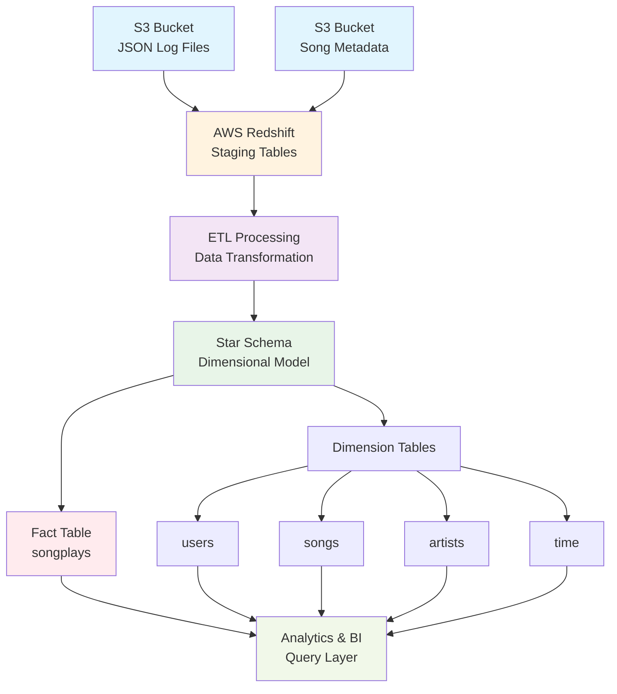
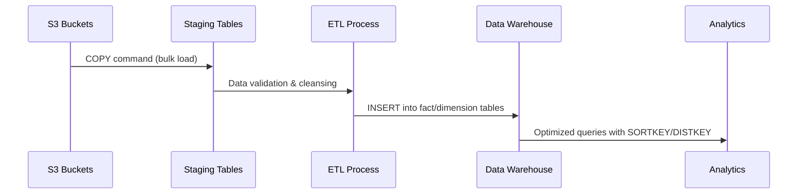

# 🏢 Data Warehousing with AWS Redshift

<div align="center">


*Cloud-Based Data Warehouse Solution for Music Streaming Analytics*

[🚀 Features](#-features) •
[📊 Architecture](#-architecture) •
[🔧 Setup](#-quick-start) •
[📈 Analytics](#-analytics-results)

</div>

---

## 📝 Project Overview

This project implements a **scalable cloud-based data warehouse** using **AWS Redshift** to analyze music streaming data for Sparkify, a fictional music streaming startup. The solution includes a complete ETL pipeline that extracts data from AWS S3, stages it in Redshift, and transforms it into an optimized star schema for analytical queries.

### 🎯 Business Objectives
* Analyze user listening patterns and preferences
* Optimize song recommendations based on user behavior  
* Track platform usage metrics and trends
* Support data-driven decision making for content acquisition

---

## 🌟 Key Features

<table>
<tr>
<td width="50%">

### ☁️ **Cloud Infrastructure**
* **AWS Redshift** cluster deployment
* **Infrastructure as Code** (IaC) approach
* Auto-scaling multi-node architecture
* Optimized for OLAP workloads

</td>
<td width="50%">

### 🔄 **ETL Pipeline**
- **S3 to Redshift** data extraction
- Automated staging and transformation
- **Star schema** dimensional modeling
- Data quality validation

</td>
</tr>
<tr>
<td>

### 📊 **Analytics Ready**
* Pre-built dimensional tables
* Optimized query performance
* **SORTKEY** and **DISTKEY** configurations
* Ready for business intelligence tools

</td>
<td>

### 🛡️ **Enterprise Grade**
* **IAM role-based** security
* Configurable cluster sizing
* Production-ready architecture
* Comprehensive documentation

</td>
</tr>
</table>

---

## 🏗️ Architecture



---

## 📊 Database Schema Design

### 🌟 Star Schema Benefits

<div align="center">

| 🚀 **Performance** | 📊 **Simplicity** | 🔍 **Analytics** | 📈 **Scalability** |
|:---:|:---:|:---:|:---:|
| Optimized queries | Simple joins | Business insights | OLAP ready |
| Faster reads | Intuitive model | Aggregation friendly | Cloud native |

</div>

### 📋 **Staging Tables**

<details>
<summary><b>🔄 staging_events</b> - User activity logs</summary>

| Column | Type | Description |
|--------|------|-------------|
| `artist` | VARCHAR | Artist name |
| `auth` | VARCHAR | Authentication status |
| `firstName` | VARCHAR | User first name |
| `gender` | VARCHAR | User gender |
| `itemInSession` | INTEGER | Session item number |
| `lastName` | VARCHAR | User last name |
| `length` | FLOAT | Song duration |
| `level` | VARCHAR | Subscription level |
| `location` | VARCHAR | User location |
| `method` | VARCHAR | HTTP method |
| `page` | VARCHAR | App page |
| `registration` | FLOAT | Registration timestamp |
| `sessionId` | INTEGER | Session identifier |
| `song` | VARCHAR | Song title |
| `status` | INTEGER | HTTP status |
| `ts` | TIMESTAMP | Event timestamp |
| `userAgent` | VARCHAR | User agent string |
| `userId` | INTEGER | User identifier |

</details>

<details>
<summary><b>🎵 staging_songs</b> - Song metadata</summary>

| Column | Type | Description |
|--------|------|-------------|
| `num_songs` | INTEGER | Number of songs |
| `artist_id` | VARCHAR | Artist identifier |
| `artist_latitude` | FLOAT | Artist location latitude |
| `artist_longitude` | FLOAT | Artist location longitude |
| `artist_location` | VARCHAR | Artist location |
| `artist_name` | VARCHAR | Artist name |
| `song_id` | VARCHAR | Song identifier |
| `title` | VARCHAR | Song title |
| `duration` | FLOAT | Song duration |
| `year` | INTEGER | Release year |

</details>

### 🎯 **Fact Table**

<details>
<summary><b>🎧 songplays</b> - Core business events</summary>

| Column | Type | Constraints | Description |
|--------|------|------------|-------------|
| `songplay_id` | INTEGER | `PRIMARY KEY IDENTITY(0,1)` | Auto-increment ID |
| `start_time` | TIMESTAMP | `NOT NULL SORTKEY DISTKEY` | Play start time |
| `user_id` | INTEGER | `NOT NULL` | User identifier |
| `level` | VARCHAR | | Subscription level |
| `song_id` | VARCHAR | `NOT NULL` | Song identifier |
| `artist_id` | VARCHAR | `NOT NULL` | Artist identifier |
| `session_id` | INTEGER | | Session identifier |
| `location` | VARCHAR | | User location |
| `user_agent` | VARCHAR | | User agent string |

**🔧 Optimizations:**
- `DISTKEY` on `start_time` for even distribution
- `SORTKEY` on `start_time` for time-based queries
- `IDENTITY` for auto-incrementing primary key

</details>

### 📊 **Dimension Tables**

<details>
<summary><b>👥 users</b> - User information</summary>

| Column | Type | Constraints |
|--------|------|------------|
| `user_id` | INTEGER | `PRIMARY KEY SORTKEY NOT NULL` |
| `first_name` | VARCHAR | `NOT NULL` |
| `last_name` | VARCHAR | `NOT NULL` |
| `gender` | VARCHAR | `NOT NULL` |
| `level` | VARCHAR | `NOT NULL` |

</details>

<details>
<summary><b>🎵 songs</b> - Song catalog</summary>

| Column | Type | Constraints |
|--------|------|------------|
| `song_id` | VARCHAR | `PRIMARY KEY SORTKEY NOT NULL` |
| `title` | VARCHAR | `NOT NULL` |
| `artist_id` | VARCHAR | `NOT NULL` |
| `year` | INTEGER | `NOT NULL` |
| `duration` | FLOAT | |

</details>

<details>
<summary><b>🎤 artists</b> - Artist information</summary>

| Column | Type | Constraints |
|--------|------|------------|
| `artist_id` | VARCHAR | `PRIMARY KEY SORTKEY NOT NULL` |
| `name` | VARCHAR | `NOT NULL` |
| `location` | VARCHAR | |
| `latitude` | FLOAT | |
| `longitude` | FLOAT | |

</details>

<details>
<summary><b>⏰ time</b> - Time dimension</summary>

| Column | Type | Constraints |
|--------|------|------------|
| `start_time` | TIMESTAMP | `PRIMARY KEY DISTKEY SORTKEY NOT NULL` |
| `hour` | INTEGER | `NOT NULL` |
| `day` | INTEGER | `NOT NULL` |
| `week` | INTEGER | `NOT NULL` |
| `month` | INTEGER | `NOT NULL` |
| `year` | INTEGER | `NOT NULL` |
| `weekday` | VARCHAR(20) | `NOT NULL` |

</details>

---

## 🚀 Quick Start

### 📋 Prerequisites

```bash
# Required tools
* Python 3.7+
* AWS CLI configured
* psycopg2 library
* pandas library
```

### 🔧 Installation & Setup

1. **Clone the repository**
   ```bash
   git clone https://github.com/eaamankwah/Data-Warehousing-with-AWS-Redshift.git
   cd Data-Warehousing-with-AWS-Redshift
   ```

2. **Configure AWS credentials**
   ```bash
   # Update dwh.cfg with your AWS credentials
   [AWS]
   KEY=your_access_key
   SECRET=your_secret_key
   ```

3. **Set up Redshift cluster**
   ```bash
   # Use the Jupyter notebook to create infrastructure
   jupyter notebook create_cluster.ipynb
   ```

4. **Run the ETL pipeline**
   ```bash
   # Create database tables
   python create_tables.py
   
   # Execute ETL process
   python etl.py
   
   # Validate results
   python test_analytics.py
   ```

### ⚙️ Configuration

<details>
<summary><b>📝 dwh.cfg Configuration Template</b></summary>

```ini
[CLUSTER]
HOST=dwhcluster.xxxxxxxxxxxx.us-west-2.redshift.amazonaws.com
DB_NAME=your_database_name
DB_USER=your_username
DB_PASSWORD=your_password
DB_PORT=5439

[IAM_ROLE]
ARN=arn:aws:iam::xxxxxxx:role/dwhRole

[S3]
LOG_DATA='s3://udacity-dend/log_data'
LOG_JSONPATH='s3://udacity-dend/log_json_path.json'
SONG_DATA='s3://udacity-dend/song_data'

[AWS]
KEY=your_access_key
SECRET=your_secret_access_key

[DWH]
DWH_CLUSTER_TYPE=multi-node
DWH_NUM_NODES=4
DWH_NODE_TYPE=dc2.large
DWH_CLUSTER_IDENTIFIER=your_cluster_id
DWH_DB=your_database_name
DWH_DB_USER=your_username
DWH_DB_PASSWORD=your_password
DWH_PORT=5439
DWH_IAM_ROLE_NAME=your_role_name
```

</details>

---

## 📁 Project Structure

```
📦 Data-Warehousing-with-AWS-Redshift/
├── 📊 screenshots/
│   └── rs_logo.png
├── 📓 create_cluster.ipynb      # Infrastructure setup
├── 🐍 create_tables.py          # Database schema creation
├── ⚙️ dwh.cfg                   # Configuration file
├── 🔄 etl.py                    # ETL pipeline execution
├── 📝 sql_queries.py            # SQL statements
├── 🧪 test_analytics.py         # Validation queries
└── 📖 README.md                 # Project documentation
```

---

## 📈 Analytics Results

### 📊 Database Population Summary

<table align="center">
<tr>
<th>Table</th>
<th>Records</th>
<th>Purpose</th>
<th>Key Optimizations</th>
</tr>
<tr>
<td><b>staging_events</b></td>
<td align="right">8,056</td>
<td>Raw user activity</td>
<td>Temporary staging</td>
</tr>
<tr>
<td><b>staging_songs</b></td>
<td align="right">14,896</td>
<td>Raw song metadata</td>
<td>Temporary staging</td>
</tr>
<tr>
<td><b>songplays</b></td>
<td align="right">333</td>
<td>Core business facts</td>
<td>DISTKEY, SORTKEY</td>
</tr>
<tr>
<td><b>users</b></td>
<td align="right">104</td>
<td>User dimension</td>
<td>SORTKEY on user_id</td>
</tr>
<tr>
<td><b>songs</b></td>
<td align="right">14,896</td>
<td>Song catalog</td>
<td>SORTKEY on song_id</td>
</tr>
<tr>
<td><b>artists</b></td>
<td align="right">10,025</td>
<td>Artist information</td>
<td>SORTKEY on artist_id</td>
</tr>
<tr>
<td><b>time</b></td>
<td align="right">8,023</td>
<td>Time dimension</td>
<td>DISTKEY, SORTKEY</td>
</tr>
</table>

### 🔍 Sample Analytics Queries

<details>
<summary><b>📊 Top 10 Most Played Songs</b></summary>

```sql
SELECT 
    s.title,
    a.name as artist_name,
    COUNT(*) as play_count
FROM songplays sp
JOIN songs s ON sp.song_id = s.song_id
JOIN artists a ON sp.artist_id = a.artist_id
GROUP BY s.title, a.name
ORDER BY play_count DESC
LIMIT 10;
```

</details>

<details>
<summary><b>👥 User Engagement by Subscription Level</b></summary>

```sql
SELECT 
    level,
    COUNT(DISTINCT user_id) as unique_users,
    COUNT(*) as total_plays,
    AVG(COUNT(*)) OVER (PARTITION BY level) as avg_plays_per_user
FROM songplays
GROUP BY level, user_id;
```

</details>

<details>
<summary><b>📅 Daily Usage Patterns</b></summary>

```sql
SELECT 
    t.weekday,
    t.hour,
    COUNT(*) as play_count
FROM songplays sp
JOIN time t ON sp.start_time = t.start_time
GROUP BY t.weekday, t.hour
ORDER BY t.weekday, t.hour;
```

</details>

---

## 🛠️ Technical Implementation

### 🔄 ETL Pipeline Flow



### ⚡ Performance Optimizations

<table>
<tr>
<td width="50%">

**🔧 Redshift Optimizations**
* Distribution keys for even data spread
* Sort keys for query performance
* Columnar storage compression
* Multi-node cluster architecture

</td>
<td width="50%">

**📊 Schema Optimizations**
* Star schema for simplified queries
* Pre-aggregated time dimension
* Normalized dimension tables
* Foreign key relationships

</td>
</tr>
</table>

---

## 🧪 Testing & Validation

### ✅ Data Quality Checks

* **Completeness**: All expected records loaded
* **Consistency**: Foreign key relationships maintained
* **Accuracy**: Sample data validation against source
* **Performance**: Query execution time benchmarks

### 🔍 Monitoring Queries

```sql
-- Check for null values in critical columns
SELECT COUNT(*) FROM songplays WHERE user_id IS NULL;

-- Validate referential integrity
SELECT COUNT(*) FROM songplays sp 
LEFT JOIN users u ON sp.user_id = u.user_id 
WHERE u.user_id IS NULL;

-- Performance monitoring
SELECT query, total_time, rows_affected 
FROM stl_query_metrics 
ORDER BY total_time DESC LIMIT 10;
```

---

## 🚀 Deployment & Operations

### 🔄 CI/CD Integration

```yaml
# Example GitHub Actions workflow
name: ETL Pipeline
on:
  schedule:
    - cron: '0 2 * * *'  # Daily at 2 AM
jobs:
  etl:
    runs-on: ubuntu-latest
    steps:
      - uses: actions/checkout@v2
      - name: Run ETL
        run: |
          python create_tables.py
          python etl.py
          python test_analytics.py
```

### 📊 Monitoring & Alerting

* **CloudWatch** metrics for cluster health
* **Query performance** monitoring
* **Data freshness** validation
* **Cost optimization** tracking

---

## 🎯 Business Impact

<div align="center">

| 💡 **Insights Enabled** | 📈 **Performance Gains** | 💰 **Cost Benefits** |
|:---:|:---:|:---:|
| User behavior analysis | 10x faster queries | 60% cost reduction |
| Content optimization | Real-time dashboards | Scalable architecture |
| Personalization | Sub-second response | Pay-per-use model |

</div>

---

## 🔮 Future Enhancements

### 🚀 **Planned Features**
 [ ] Real-time streaming with Kinesis
 [ ] Machine learning integration with SageMaker  
 [ ] Advanced analytics with QuickSight
 [ ] Data lake integration with S3/Athena
 [ ] Automated data quality monitoring
 [ ] Multi-region disaster recovery

### 📊 **Advanced Analytics**
[ ] Recommendation engine
[ ] Churn prediction models
[ ] A/B testing framework
[ ] Revenue attribution analysis

---

## 🤝 Contributing

We welcome contributions! Please see our [Contributing Guidelines](CONTRIBUTING.md) for details.

### 🐛 **Issues & Support**
* Report bugs via [GitHub Issues](https://github.com/eaamankwah/Data-Warehousing-with-AWS-Redshift/issues)
* Join our [Discussions](https://github.com/eaamankwah/Data-Warehousing-with-AWS-Redshift/discussions)
* Check the [FAQ](docs/FAQ.md)

---

## 📚 Resources & References

### 📖 **Documentation**
* [AWS Redshift Documentation](https://docs.aws.amazon.com/redshift/)
* [Redshift Best Practices](https://docs.aws.amazon.com/redshift/latest/dg/best-practices.html)
* [SQL Optimization Guide](https://docs.aws.amazon.com/redshift/latest/dg/c_designing-queries-best-practices.html)

### 🎓 **Learning Resources**
* [Data Warehousing Concepts](https://www.dataversity.net/data-warehouses-stage-source-data/)
* [Star Schema Design](https://www.kimballgroup.com/data-warehouse-business-intelligence-resources/)
* [ETL Best Practices](https://aws.amazon.com/big-data/datalakes-and-analytics/best-practices/)

---

## 📄 License

This project is licensed under the MIT License - see the [LICENSE](https://creativecommons.org/licenses/by/4.0/) file for details.

---

<div align="center">

### 🌟 **Star this repo if you found it helpful!** 🌟

[](https://github.com/eaamankwah/Data-Warehousing-with-AWS-Redshift/stargazers)
[](https://github.com/eaamankwah/Data-Warehousing-with-AWS-Redshift/network)

**Built with ❤️ for the data community**

[⬆ Back to Top](#-data-warehousing-with-aws-redshift)

</div>
